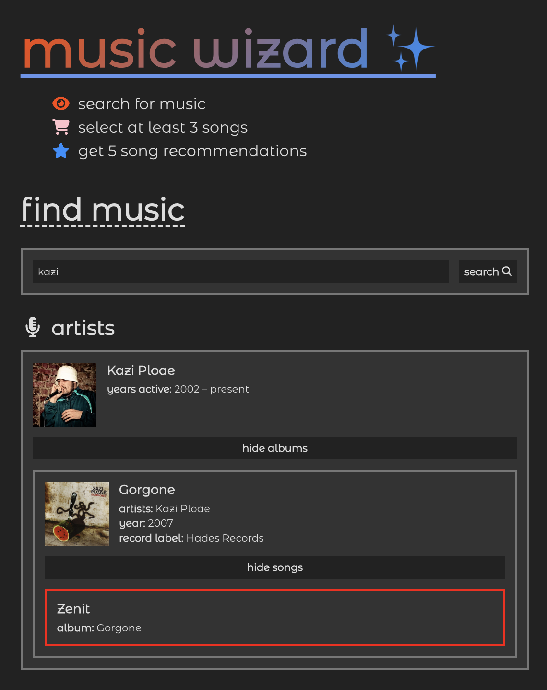

# Music App

This is a music web app based on microservices.

## 🏗️ Installation

Clone the project:

```sh
git clone git@github.com:gareth618/music-app.git
cd music-app
```

### Backend

Go to the backend directory:

```sh
cd backend
```

Set up a new MongoDB database and create a `.env` file with the following structure:

```
DB_USERNAME=...
DB_PASSWORD=...
DB_CLUSTER=...
```

Populate the database by running:

```sh
deno run -A init.ts
```

Start up the backend server by running:

```sh
deno run -A server.ts
```

### Frontend

Go to the frontend directory:

```sh
cd frontend
```

Install Node packages:

```sh
yarn install
```

Start up the frontend server by running:

```sh
yarn run dev
```

Go to [/](http://localhost:3000/) for the user interface and to [/admin](http://localhost:3000/admin) for the admin panel.



## 🚀 Tech Stack

- **backend:** Deno + Oak + MongoDB [455 lines]
- **frontend:** Node + Nuxt + Vue + Vanilla CSS (as _always_) [1101 lines]
- **total:** 1556 lines

## 📚 Collections

```
Artist {
  name: string,
  photoUrl?: string,
  members?: [Artist]+,    # not undefined if band
  activity: {
    start: int,
    end?: int             # undefined if artist still active
  }
}
```

```
Album {
  name: string,
  photoUrl?: string,
  artists: [Artist]+,
  year: int,
  recordLabel?: string
}
```

```
Song {
  name: string,
  album: Album,
  featuredArtists?: [Artist]+
}
```

## 🔭 **Service #1:** RESTful API

- **GET** `/rest/artists` ➡️ [Artist]*
- **GET** `/rest/artists/:artist.name` ➡️ Artist
- **GET** `/rest/artists/:artist.name/albums` ➡️ [Album]*
- **GET** `/rest/artists/:artist.name/songs` ➡️ [Song]*
- **POST/ PUT** `/rest/artists`
- **DELETE** `/rest/artists/:artist.name` deletes their albums and songs too

---

- **GET** `/rest/albums?year=int&recordLabel=string` ➡️ [Album]*
- **GET** `/rest/albums/:album.name` ➡️ Album
- **GET** `/rest/albums/:album.name/songs` ➡️ [Song]*
- **POST/ PUT** `/rest/albums`
- **DELETE** `/rest/albums/:album.name` deletes its songs too

---

- **GET** `/rest/songs` ➡️ [Song]*
- **GET** `/rest/songs/:song.name` ➡️ Song
- **POST/ PUT** `/rest/songs`
- **DELETE** `/rest/songs/:song.name`

## 🔍 **Service #2:** Search Engine

- **PUT** `/search`

```
Input {
  keywords: []{1,}
}
```

```
Output {
  artists: [Artist]{0,10},
  albums: [Album]{0,10},
  songs: [Song]{0,10}
}
```

## 🪄 **Service #3:** Recommendation Engine

- **PUT** `/feed`

```
Input {
  songs: [Song]{3,}
}
```

```
Output {
  songs: [Song]{5}
}
```
